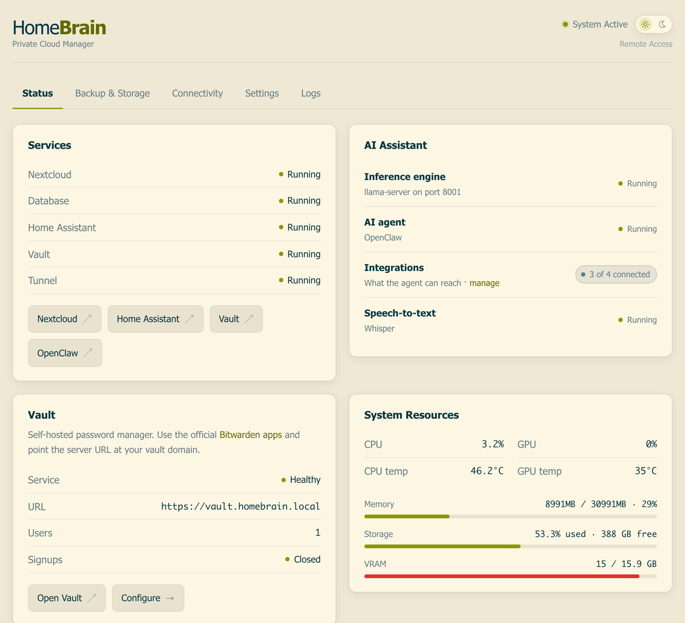
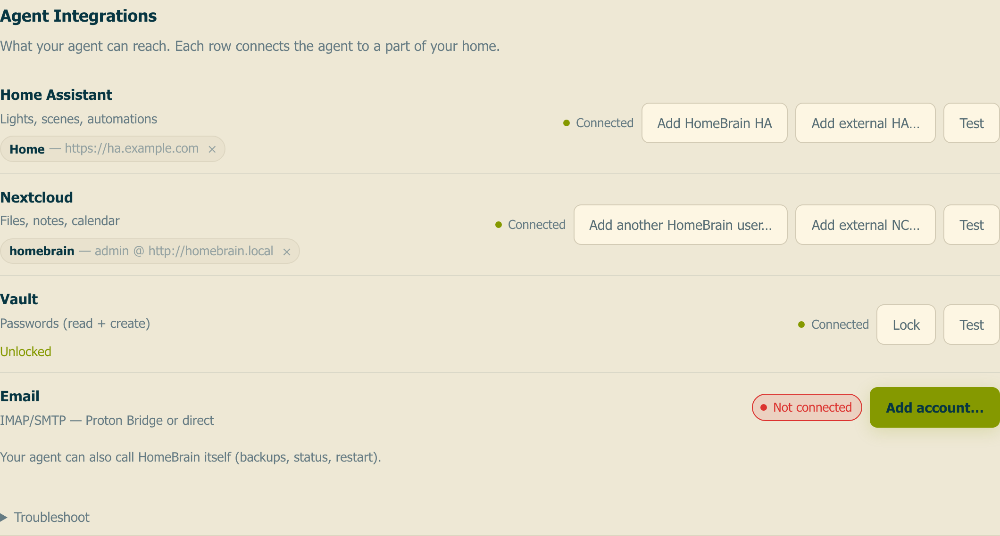

# HomeBrain

**Your private cloud, smart home, and personal AI agent — in one box.**

No subscriptions. No cloud accounts. No data leaves your network.

HomeBrain provisions a complete self-hosted stack on a single machine: Nextcloud for files and calendars, Home Assistant for the smart home, Vaultwarden for passwords, and — on GPU hardware — OpenClaw, a personal AI agent running on local llama.cpp inference.

One command installs it. A browser wizard configures it. You own the whole thing.

<p align="center">
  <picture>
    <source media="(prefers-color-scheme: dark)" srcset="res/screenshot-dark.png">
    
  </picture>
</p>

<p align="center"><sub>Solarized Light, and a dark theme. The dashboard loads nothing from the internet — no CDN, no web fonts, no analytics — so it renders identically on a box with the WAN unplugged.</sub></p>

---

## Why

- **Truly private** — files, passwords, conversations, and automations run on hardware you control. Zero telemetry.
- **An agent, not a chatbot** — it acts: reads your calendar, toggles lights, pulls files, drafts email. Every token stays on your GPU.
- **Your messenger is the interface** — ask Telegram for a file and it arrives. No VPN, no port forwarding, no app to install. For day-to-day use the tunnel is optional.
- **Backup that restores** — scheduled snapshots with retention, off-site mirroring, one-click restore from the dashboard.

## The agent's reach

Each integration is one row: connect it, test it, revoke it. The agent talks to every service over MCP.

<p align="center">
  <picture>
    <source media="(prefers-color-scheme: dark)" srcset="res/agent-dark.png">
    
  </picture>
</p>

---

## Architecture

```
Nextcloud          Docker     Files, calendars, contacts
Home Assistant     Docker     Smart-home automation
Vaultwarden        Docker     Password manager (Bitwarden-compatible)
MariaDB            Docker     Nextcloud + Vault database
Pangolin Newt      Docker     Encrypted tunnel            optional
llama-server       systemd    Local LLM inference         GPU only
whisper-server     systemd    Speech-to-text              GPU only
OpenClaw           systemd    AI agent on Telegram        GPU only
```

Dependency versions are pinned in [`config/versions.json`](config/versions.json) and updated from the dashboard in one click.

**Two profiles, detected automatically.** With an AMD GPU you get **HomeBrain** — the full stack including the AI agent. Without one you get **HomeCloud** — the same private cloud and smart-home hub, no AI, and it runs on ARM or x86_64 alike.

---

## Hardware

| | Reference build |
|---|---|
| CPU | AMD Ryzen 5 / Intel i5 or better |
| RAM | 32 GB |
| Storage | 512 GB NVMe |
| GPU | AMD Radeon RX 9060 XT (16 GB VRAM) |
| OS | Ubuntu 24.04 LTS |

Inference runs on Vulkan via Mesa RADV — no ROCm install required. ~29 tok/s generation, ~750 tok/s prompt processing at 131K context; see [BENCHMARKS.md](docs/BENCHMARKS.md).

HomeCloud is architecture-agnostic. Reference build: Raspberry Pi 5 (8 GB) with an SSD on Raspberry Pi OS Trixie, 64-bit.

---

## Install

```bash
# Ubuntu 24.04+ / Raspberry Pi OS 64-bit
curl -fsSL https://raw.githubusercontent.com/oalterg/HomeBrain/main/install | sudo bash
sudo /opt/homebrain/scripts/provision.sh
sudo reboot
```

After the reboot, open `http://<server-ip>` and the wizard walks you through deployment mode, passwords, and model selection.

To skip the wizard, pass everything to `provision.sh`:

```bash
# Remote access via a Pangolin tunnel
sudo /opt/homebrain/scripts/provision.sh \
  "<NEWT_ID>" "<NEWT_SECRET>" "<TUNNEL_DOMAIN>" "<PANGOLIN_ENDPOINT>" "<PASSWORD>"

# Local network only
sudo /opt/homebrain/scripts/provision.sh "<PASSWORD>"
```

Omit the password and one is generated for you.

---

## Documentation

| Doc | What's in it |
|-----|-------------|
| [BENCHMARKS.md](docs/BENCHMARKS.md) | Inference throughput, quantization comparisons, tuning notes |
| [ROADMAP.md](docs/ROADMAP.md) | Shipped features and what's next |
| [TESTING.md](docs/TESTING.md) | E2E verification checklist |
| [AGENTS.md](AGENTS.md) | Contributor conventions for AI-assisted development |

## License

BSD-3-Clause — see [LICENSE](LICENSE).
