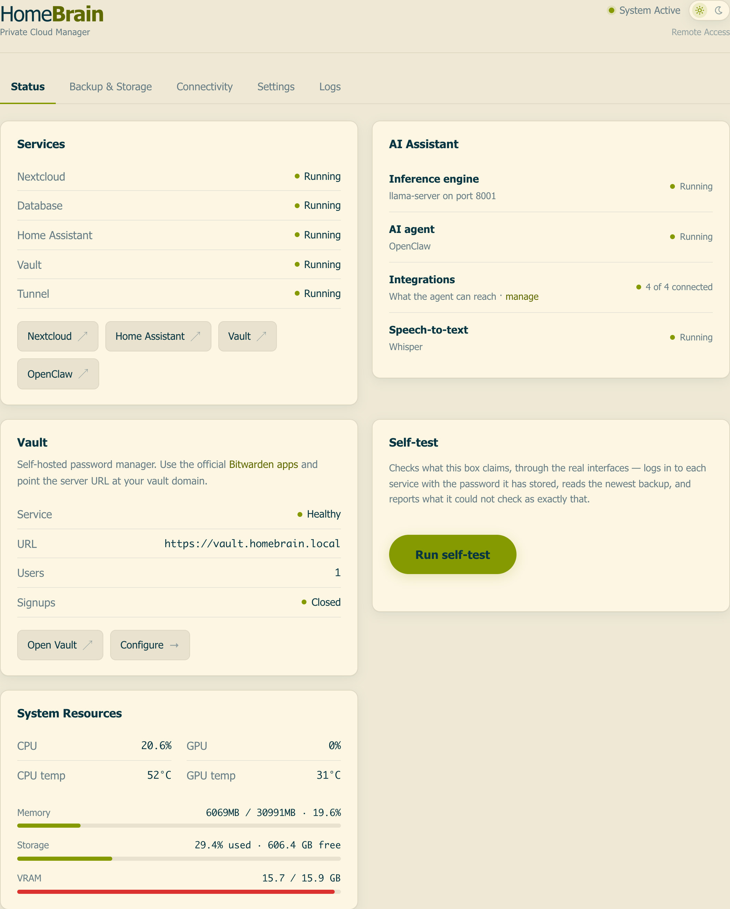
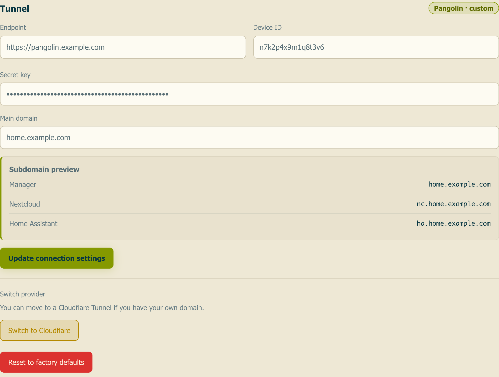
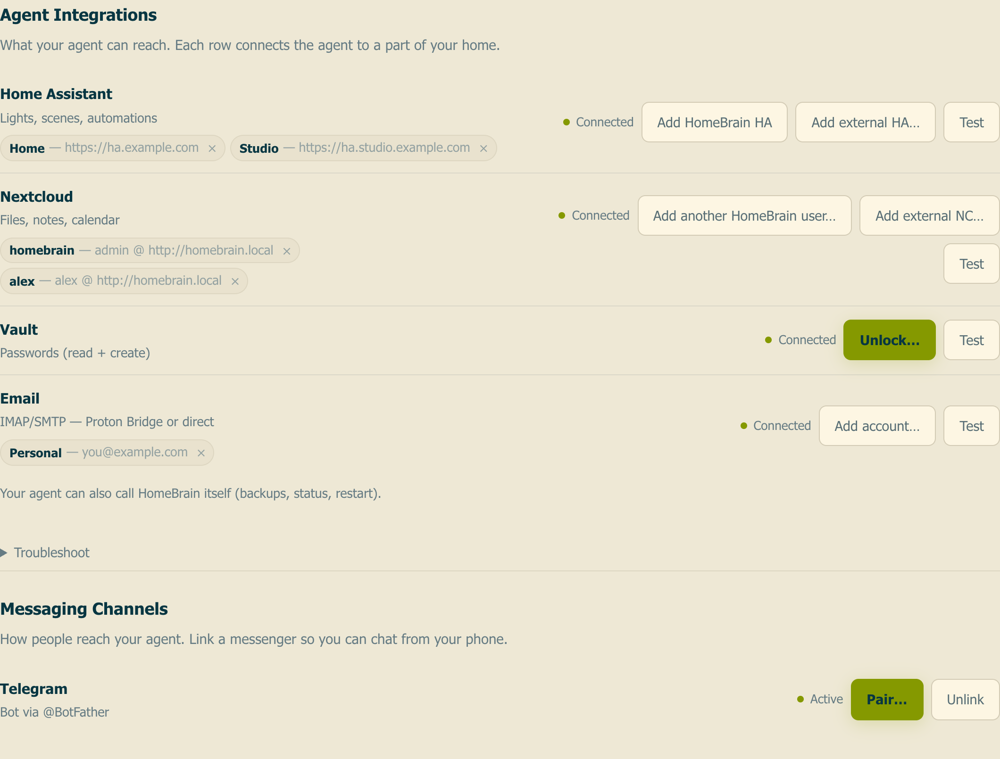
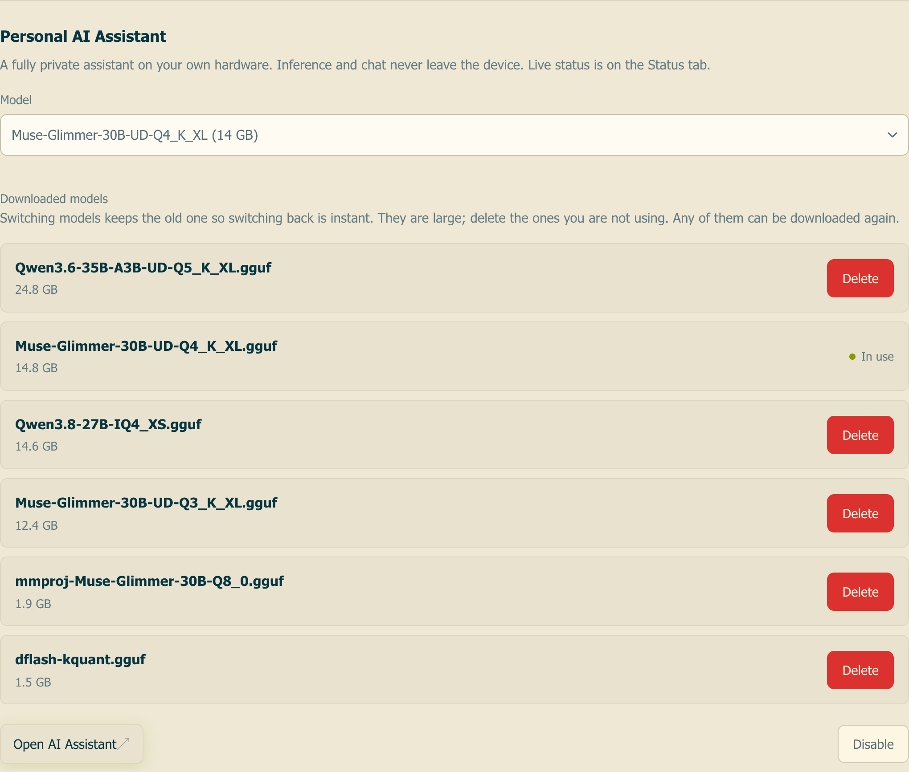
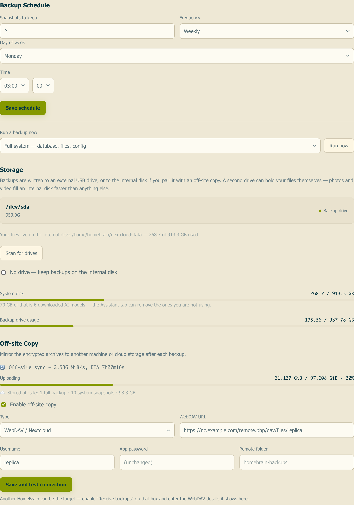

# HomeBrain

**Your private local cloud, agent wired into everything.**

Nextcloud, Home Assistant, Vaultwarden, and a local AI agent are four products. HomeBrain is the appliance that makes them one: a single password, a backup that restores the whole box, updates that will not brick you, and — on a GPU — an agent that operates it so you never need a shell.

No subscriptions. No cloud accounts. No one else's servers.

A browser wizard configures it. Nothing leaves the box.

<p align="center">
  
</p>

<p align="center"><sub>Solarized Light, with a dark theme a click away. The dashboard loads nothing from the internet — no CDN, no web fonts, no analytics — so it renders identically on a box with the WAN unplugged.</sub></p>

A GPU runs the agent. Without one, the same install is **HomeCloud**: files, home, vault. ARM or x86_64.

---

## Why this, not four apps

- **One secret, one recovery** — dashboard, files, smart home, and backup encryption share a master password. People you add get one password of their own, for files and (if you tick them) vault and Home Assistant. A recovery phrase, shown once, resets the lot — including issued member vaults, unless they changed that password in the Bitwarden app.
- **An agent that acts** — calendar, lights, files, email. Every token stays on your GPU.
- **Backup that restores the composition** — not four separate dumps. Scheduled, encrypted, off-site, one click from the dashboard.
- **It runs itself** — pinned versions, downgrades blocked, a factory reset back to the wizard. Health alerts while the box is up.

---

## How you reach it

On the LAN, open `http://<server-ip>`. Nextcloud and Vault also speak HTTPS on local ports.

With a GPU, Telegram is the daily interface: no VPN, no extra app. Pair it after setup. A public tunnel is optional, if you want the web UIs from outside.

Without a GPU, a [Pangolin](docs/PANGOLIN.md) tunnel is how you reach the browser from outside.

<p align="center">
  
</p>

<p align="center"><sub>One domain in, three subdomains out — no port forwarding and no inbound firewall rule. The same screen moves the box to a Cloudflare Tunnel, or reverts every field to what the device shipped with.</sub></p>

---

## The agent's reach

Dim the living room. Fetch the latest invoice from Nextcloud. Each integration is one row: connect it, test it, revoke it. The agent talks to every service from there. More than one account per service is fine — two homes, two Nextcloud users, several mailboxes.

<p align="center">
  
</p>

<p align="center"><sub>Below the integrations sits the other half: the messenger the agent answers on. Pairing is a code, not a port.</sub></p>

---

## The model is a setting

<p align="center">
  
</p>

<p align="center"><sub>Download a model, switch to it, delete the ones you are not using. The previous model stays on disk, so switching back is instant. Weights are fetched once, from the dashboard — never at inference time.</sub></p>

---

## Where the backup goes

<p align="center">
  
</p>

<p align="center"><sub>A schedule, a drive, and somewhere off-site — the whole backup story is one tab. Archives are encrypted before they leave the box, so the target never sees your data. New archives open with your master password or your recovery phrase. WebDAV, SFTP or S3 — or a second HomeBrain, which hands out a dedicated <code>replica</code> account for exactly this.</sub></p>

---

## Architecture

```
Nextcloud          Docker     Files, calendars, contacts
Home Assistant     Docker     Smart-home automation
Vaultwarden        Docker     Password manager (Bitwarden-compatible)
MariaDB            Docker     Nextcloud + Vault database
Pangolin Newt      Docker     Encrypted tunnel            optional
llama-server       systemd    Local LLM inference         GPU only
whisper-server     systemd    Speech-to-text              GPU only
OpenClaw           systemd    AI agent on Telegram        GPU only
```

Versions are pinned and updated from the dashboard in one click.

---

## Hardware

| | HomeBrain | HomeCloud |
|---|---|---|
| CPU | AMD Ryzen 5 / Intel i5 or better | Raspberry Pi 5 |
| RAM | 32 GB | 8 GB |
| Storage | 512 GB NVMe | SSD |
| GPU | AMD Radeon RX 9060 XT (16 GB VRAM) | — |
| OS | Ubuntu 24.04 LTS | Raspberry Pi OS Trixie 64-bit |

Inference is Vulkan via Mesa RADV — no ROCm. Throughput and tuning: [BENCHMARKS.md](docs/BENCHMARKS.md).

---

## Install

```bash
# Ubuntu 24.04+ / Raspberry Pi OS 64-bit
curl -fsSL https://raw.githubusercontent.com/oalterg/HomeBrain/main/install | sudo bash
sudo /opt/homebrain/scripts/provision.sh
```

Open `http://<server-ip>`, log in, and initialize. Local network is the default. The wizard shows the generated master password and recovery phrase **once**. (Restoring from backup: enter the old master password to keep it, or the recovery phrase to decrypt and set a new one.)

`provision.sh` prepares the host and starts the manager. It prints a factory password once if you did not pass `--factory-pass`; that password opens the wizard and is stored in `factory_config.txt` (mode 600). On AMD GPU hardware a reboot is recommended so kernel parameters take effect; it is not required to open the wizard.

Tunnel credentials at provision time are stored on the box and selected in the wizard — they do not skip it. On an already-set-up box the same command repoints the live tunnel without wiping data. Flags and the Pangolin resource map: [PANGOLIN.md](docs/PANGOLIN.md).

---

## Documentation

| Doc | What's in it |
|-----|-------------|
| [BENCHMARKS.md](docs/BENCHMARKS.md) | Inference throughput, quantization comparisons, tuning notes |
| [DISASTER_RECOVERY.md](docs/DISASTER_RECOVERY.md) | Getting your data back onto new hardware after the box is gone |
| [PANGOLIN.md](docs/PANGOLIN.md) | Optional browser tunnel (no GPU, or GPU-box web UIs from outside) |
| [ROADMAP.md](docs/ROADMAP.md) | Shipped features and what's next |
| [PRODUCT_REVIEW_2026-08.md](docs/plans/PRODUCT_REVIEW_2026-08.md) | Why the glue is the product, and the findings we will act on |

## License

BSD-3-Clause — see [LICENSE](LICENSE).
